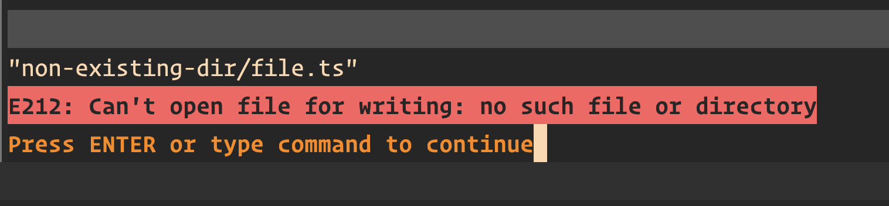

# Neovim Auto-Create Directory

[](https://opensource.org/licenses/MIT)

Neovim Auto-Create Directory is a Neovim plugin that automatically **creates non-existent directories** when saving files, ensuring a seamless editing experience.

### VIM's default behaviour


By default, VIM expects the directory to exist, & to fix this error you'll have to do:
```
# Create the directories the opened file is within
:!mkdir -p %:h
```
The plugin handles this behaviour by default implicitly, so you don't need to worry about this.

## Features

- Automatically creates directory structure when saving a file in a non-existent directory.
- Works seamlessly with Neovim's Lua API.
- Lightweight and unobtrusive.

## Installation

### [vim-plug](https://github.com/junegunn/vim-plug) (Neovim/Vim)

Add the following line to your `init.vim`:

```vim
Plug 'pezcoder/nvim-auto-create-directory'
```

Then run `:PlugInstall` to install the plugin.

### [dein.vim](https://github.com/Shougo/dein.vim) (Neovim/Vim)

Add the following line to your `init.vim`:

```vim
call dein#add('pezcoder/nvim-auto-create-directory')
```

Then run `:call dein#install()` to install the plugin.

### [packer.nvim](https://github.com/wbthomason/packer.nvim) (Neovim)

Add the following line to your `init.lua`:

```lua
use 'pezcoder/nvim-auto-create-directory'
```

Then run `:PackerInstall` to install the plugin.

Replace `pezcoder` with the GitHub username where the plugin is hosted.

## Usage

Once the plugin is installed, it will automatically create missing directories when saving a file in a non-existent directory. No additional configuration or commands are required.

## License

This project is licensed under the [MIT License](LICENSE).
